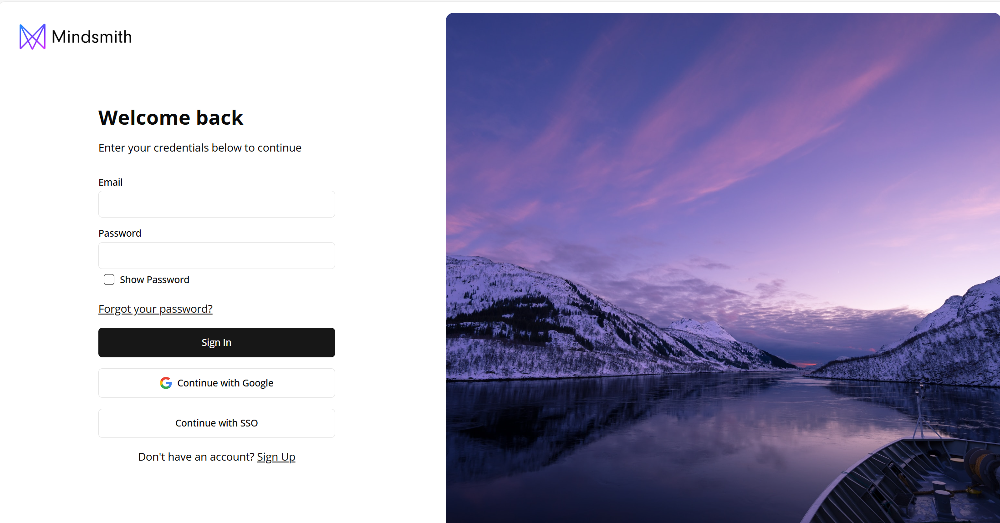
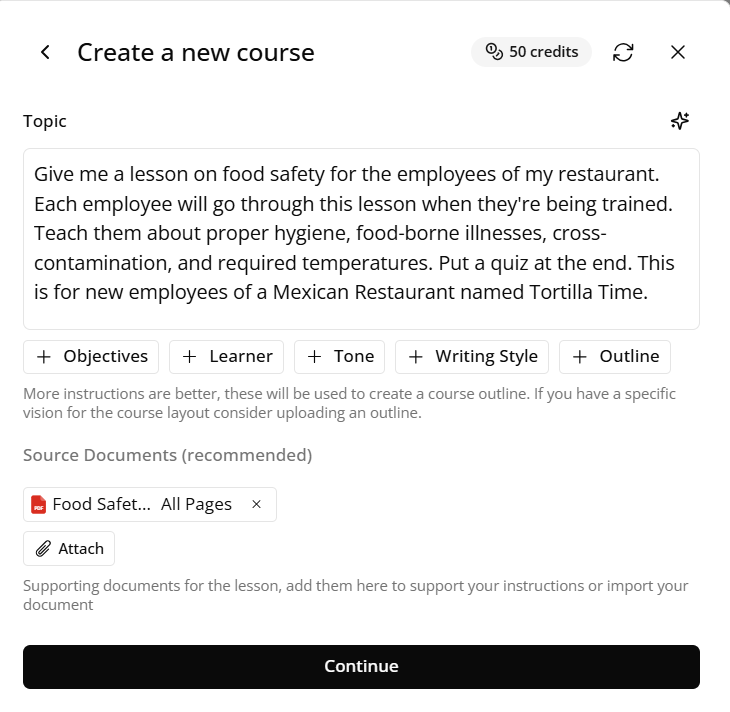
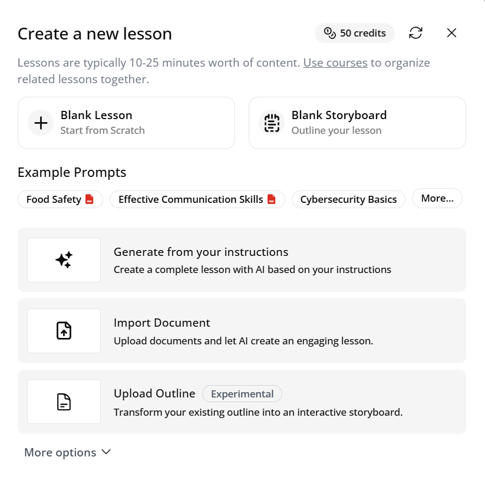
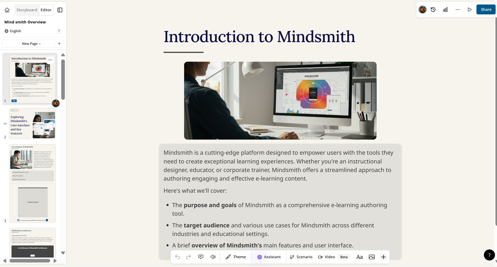
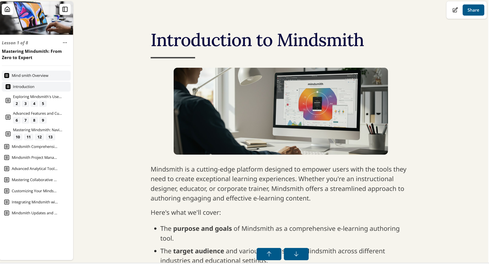
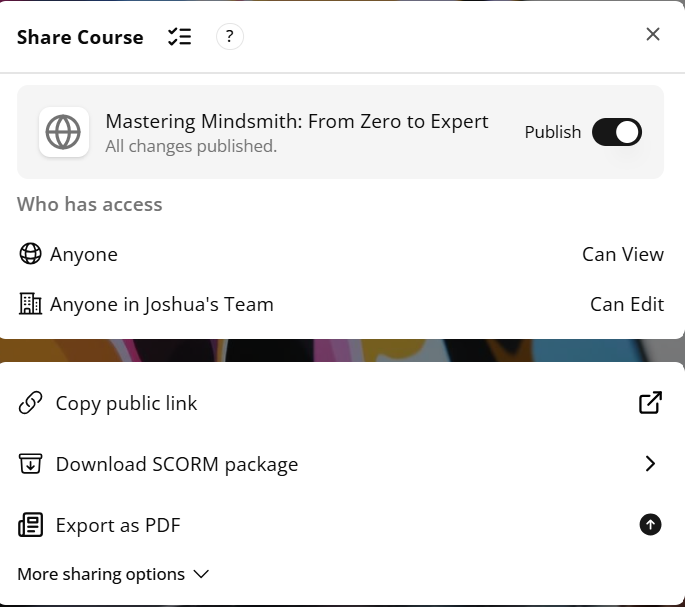

# Quick Start Guide

Welcome to Mindsmith—an AI-powered e-learning platform that helps you create, customize, and share interactive lessons and courses with ease. This guide will walk you through the essential steps for getting started, from signing up to publishing your first course. You don’t need to install anything—just follow the steps below and you’ll be on your way to creating engaging content in minutes.

Mindsmith was designed to streamline the course development process for educators, corporate trainers, and anyone looking to share knowledge. With its combination of AI-driven tools and user-friendly interface, even first-time users can create polished, professional content in just a few clicks. Whether you're building a single lesson or a comprehensive learning module, this guide will help you hit the ground running.

---

## 1. Sign Up and Log In

To begin, go to [https://mindsmith.ai](https://mindsmith.ai) and sign up for a free account using your email or Google credentials. Once you've confirmed your account, you'll be taken directly to your personal dashboard where you can begin creating content immediately.

Mindsmith is a cloud-based platform, so no downloads or installations are necessary. Logging in grants you access to course creation tools, templates, AI generation features, and publishing options—all in one streamlined interface. Your dashboard will show any courses you've started, making it easy to jump back in at any time.

  
*Figure 1. The signup interface where users can create an account using email or Google credentials.*

---

## Video Explanation

<h3>Below is a simple video to show  the different ways to make an account and sign-in and sign-out of Mindsmith.</h3>

<video controls width="600">
  <source src="/mindsmith-docs/vids/LoginMS.mp4" type="video/mp4" />
  Your browser does not support the video tag.
</video>

*Figure 2. A step-by-step visual guide shown in the video walkthrough.*

---

## 2. Create a New Course

From your dashboard, click the **“+ Create Course”** button in the top right corner. This will prompt you to name your course and optionally add a description for better organization.

Courses serve as containers for your lessons and allow you to organize your content by topic, audience, or training goal. You can always rename or reconfigure your course later. This initial setup makes it easy to manage and scale your content as you develop more material over time.

  
*Figure 3. The interface for naming and launching a new course from your dashboard.*

---

## 3. Use AI to Generate a Lesson

Once your course is created, you’ll be prompted to generate your first lesson. Enter a lesson topic or learning objective into the provided field. Then, select your desired interactivity level—such as multiple choice quizzes, short-form simulations, or simple content delivery—and click **“Generate Lesson.”**

Mindsmith’s AI will use your input to create an instructional storyboard complete with learning steps and interactive elements. This auto-generated content can be edited at any time, making it perfect for prototyping ideas or scaling your production process with minimal effort.

  
*Figure 4. The AI generation panel where users enter their lesson objective and choose interaction type.*

---

## 4. Edit and Customize the Lesson

After generation, the lesson opens in the visual editor. You can click on any part of the lesson—text, quizzes, media, or structure—to edit it. Changes are saved automatically, and the editor is intuitive enough for both beginners and experienced instructional designers.

Use the left-hand panel to manage steps and flow, and the right-hand editing pane to change content. This is where your creativity comes into play—you can tailor each lesson to match the tone, depth, and engagement style of your audience, whether it's students, employees, or public learners.

  
*Figure 5. The editing interface that supports drag-and-drop and inline editing for full control.*

---

## 5. Preview Your Course

To make sure your lesson looks and functions as expected, click the **“Preview”** button at the top of the editor. This will open an interactive learner view that mirrors what end-users will see when the course is published.

Previewing is essential for checking navigation flow, quiz logic, and overall presentation before sharing the course externally. It's also a helpful step when reviewing your edits before finalizing the structure. You’ll be able to toggle through lessons, test interactions, and ensure your content flows as intended.

  
*Figure 6. The real-time preview mode that simulates the learner experience.*

---

## 6. (FINALLY!) Publish and Share

When your lesson is ready to share, click the **“Publish”** button in the top menu. Mindsmith will provide you with a public link to your course that can be shared via email, embedded into a website, or posted in a learning management system (LMS).

Publishing makes your course available to learners outside the platform, and Mindsmith tracks engagement and completion metrics to help you evaluate success. You can update your content after publishing, and learners will always see the latest version. This allows for iterative improvements and real-time refinements even after launch.

  
*Figure 7. Publishing settings where you can generate a shareable course link.*

---

## 📽️ Video Walkthrough

<video controls width="600">
  <source src="/vids/CCPL.mp4" type="video/mp4" />
  Your browser does not support the video tag.
</video>

*Figure 8. Key screens shown during the video walkthrough that demonstrate the full course creation process.*

---

## You Did It!

You’ve successfully completed your first course in Mindsmith. Whether you're creating internal training, public educational content, or onboarding materials, Mindsmith’s intuitive interface and AI-driven tools make it simple to bring ideas to life.

To dive deeper into lesson building, branding, and advanced customization, visit the full [User Guide](../user-guide/creating-lessons.md). That guide breaks down topics like organizing course content, optimizing interactivity, and collaborating with others in more detail. 

Or you can simply click "Next" at the bottom right of the page.

---
