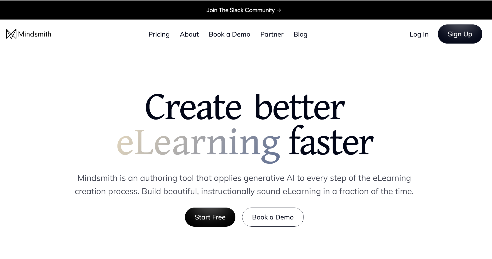
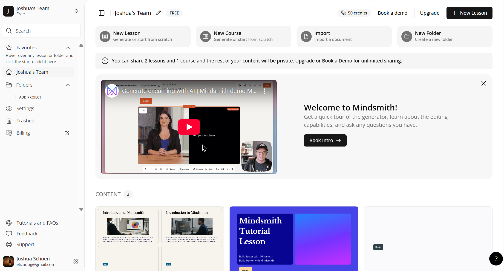
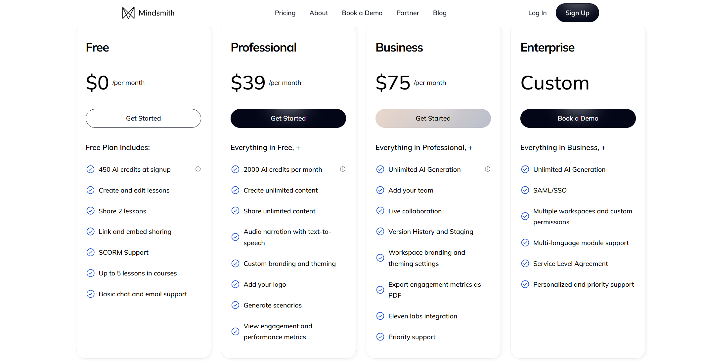

# High-Level Overview

Welcome to the Mindsmith Documentation! This page provides a high-level overview of Mindsmith, an AI-powered course creation tool designed to help educators, instructional designers, and content creators develop engaging learning experiences efficiently.

Mindsmith is similar in concept to tools like Rise360, but with a distinctive edge—it uses AI to generate storyboards and turn them into complete lessons that are embedded within courses. These courses can be customized for interactivity, making them suitable for both self-paced learners and instructor-led environments. By using AI to automate routine instructional design work, Mindsmith allows users to focus more on creativity and learning outcomes rather than time-consuming development. It’s ideal for anyone who wants to streamline the course creation process while still maintaining a high level of customization and educational value.

  
*Figure 1. Overview of the Mindsmith platform showing the course-building dashboard.*

## Key Features

- **AI Storyboard Generation**: Start with a prompt and let Mindsmith’s AI generate a complete storyboard that forms the basis of your lesson.
- **Course Assembly**: Combine multiple lessons into a structured course.
- **Interactive Content**: Choose the interactivity level to match your learner's needs—from simple informational cards to dynamic questions and media.
- **Import Capabilities**: You can import lessons from other platforms like Rise360 or even use video inputs.
- **Collaboration**: Easily share courses and collaborate with others.
- **Credit System**: Courses consume AI credits; each user starts with about 400 free credits, and each lesson uses around 80 credits.
- **Subscription**: Paid tiers available for additional credits.

Mindsmith’s key features are designed to be intuitive while still offering powerful customization options. Whether you're building a single microlearning module or a full curriculum, the tools adapt to your workflow. The AI suggestions can be edited at any time, allowing creators to maintain control while benefiting from automation. In addition, users have access to analytics and sharing features that enhance the instructional design process by providing insight into learner engagement and progress.

  
*Figure 2. The course creation interface where users can edit, preview, and structure their lessons.*

## Typical Workflow

1. **Create a New Course**: Begin by clicking “New Course” and choosing to either start from scratch or use an AI prompt.
2. **Enter Your Prompt**: The AI will generate a storyboard based on your input.
3. **Edit Lessons**: Customize each generated lesson—add or remove content, adjust media, and set interaction types.
4. **Structure the Course**: Combine multiple lessons and arrange their sequence.
5. **Preview and Share**: Test your course in preview mode and share it publicly or with collaborators.

This workflow is optimized for speed and scalability. Users can go from an idea to a finished course in minutes. The structure promotes iterative development—meaning you can revise lessons anytime while maintaining consistency across your course. This step-by-step approach is designed to minimize friction while maximizing creativity, ensuring even first-time users can build polished lessons with ease. With built-in autosaving and intuitive tools, Mindsmith makes it easy to keep your content fresh and up to date.

## See the [Quick Start Guide](../getting-started/quick-start.md) to watch a detailed video tutorial on this!

## Subscription Plans

| Plan         | Monthly Cost | Credits Included | Best For                   |
|--------------|--------------|------------------|----------------------------|
| Free         | $0           | ~400 (once)      | Casual users, trials       |
| Pro          | $30/month    | 1,500/month      | Independent educators      |
| Enterprise   | Varies       | Custom           | Institutions, businesses   |

The subscription model is flexible to accommodate different user needs. Free users can test the platform with enough credits for multiple lessons, while the Pro and Enterprise plans support more consistent and high-volume course creation. Credits are only consumed during AI generation, allowing unlimited manual editing afterward. Pro users benefit from faster support and more advanced features, while enterprise clients can access collaborative tools and administrative controls for larger teams. These options ensure that Mindsmith can scale with your goals, whether you're an individual or an organization.

  
*Figure 3. A breakdown of the different subscription plans and what each includes.*

## Customization and Flexibility

Mindsmith is built with customization in mind. You can fine-tune every element of your lessons, from the text and media to the types of interactivity—such as quizzes, flashcards, and embedded videos. This flexibility allows you to design for diverse audiences, including K-12, higher education, and corporate learners.

Whether you're importing content, designing from scratch, or remixing AI-generated materials, the platform enables a tailored experience for both creators and learners. Advanced users can even incorporate branding elements and organizational themes. From fonts and colors to layout preferences, Mindsmith allows teams to maintain brand consistency across all learning assets. It’s also great for accessibility—many options support different learning needs and styles.

## Use Cases and Audience

Mindsmith is ideal for:
- Teachers digitizing classroom materials.
- Corporate trainers building microlearning content.
- Instructional designers prototyping quickly with AI.
- Creators who want to scale knowledge-sharing.

It supports both rapid course creation and deeper customization, striking a balance between automation and control. These use cases demonstrate Mindsmith's adaptability across industries. Instructors can use it to quickly build lesson plans, while organizations may rely on it to standardize onboarding or compliance training. Additionally, freelance content creators can use Mindsmith to produce polished, client-ready modules in a fraction of the time.

--
## Video Overview
<video controls width="600">
<source src="/mindsmith-docs/vids/OverMS.mp4" type="video/mp4" />
  Your browser does not support the video tag.
</video>

---
*Figure 4. A video overview of what Mindsmith is.*

## You've completed the Overview! 
Explore other sections of the documentation to learn how to create, edit, and publish your own Mindsmith course.

Whether you're a first-time user or an experienced designer, Mindsmith is built to grow with you. Start by exploring the **[Quick Start Guide](../getting-started/quick-start.md)**, where you'll find step-by-step instructions, video walkthroughs, and tips for leveraging AI effectively. From there, you can dive deeper into advanced topics like lesson customization, media integration, and collaboration tools. With the right approach, you'll be launching interactive, AI-assisted learning experiences in no time. Mindsmith’s platform is constantly evolving, so be sure to check back for new features and best practices to enhance your instructional design.
