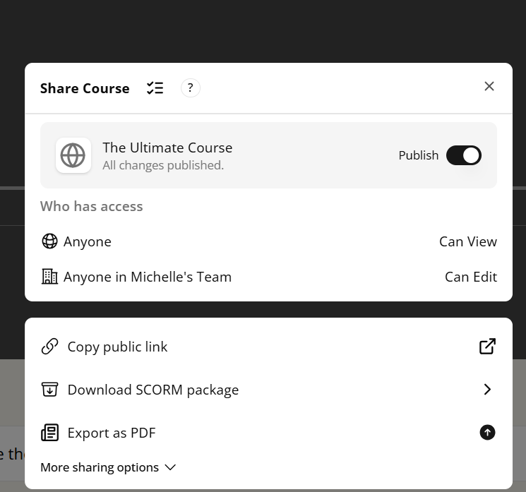

# Creating Courses in Mindsmith

Courses in Mindsmith help you organize multiple lessons into a cohesive learning path. Whether you're delivering a full onboarding sequence or a structured training series, this guide walks you through the complete process of building and publishing a course.

---

## 📘 1. What Is a Course in Mindsmith?

A **course** is a container for multiple lessons. Unlike standalone lessons, courses allow you to:

- Group related lessons together  
- Set completion order  
- Create a more comprehensive learning experience

> Think of a course as a playlist of lessons with structure and flow.

  
*Figure 1. Example of a course containing multiple lesson modules*

---

## ➕ 2. Create a New Course

To create a course from the dashboard:

1. Click the **“Courses”** tab.  
2. Select **“Create New Course”**.  
3. Add a **course title**, **description**, and **thumbnail**.  
4. Click **“Create Course”** to start building.

  
*Figure 2. Starting a new course from the dashboard*

---

## 🧩 3. Add Lessons to Your Course

Once inside the course editor:

- Click **“Add Lesson”**  
- Choose from your existing lessons  
- Drag and drop them into the order you want

You can organize lessons into **modules** or **sections** to help learners track progress.

  
*Figure 3. Adding and organizing lessons inside a course*

---

## 🛠 4. Customize Course Flow

You can configure your course to control how learners progress:

- Set **prerequisites** between lessons  
- Enable **linear navigation** or **free navigation**  
- Customize **section headers** for better clarity

  
*Figure 4. Adjusting the structure and navigation of your course*

---

## 🚀 5. Publish Your Course

Once your course is ready:

1. Click **“Publish”** in the top right corner  
2. Set visibility (private, link-only, or public)  
3. Copy the **shareable link** or embed code

Learners will access the entire course and progress through each lesson in order.

  
*Figure 5. Publishing and sharing your finished course*

---

## 👥 6. Assign Courses to Teams (Pro)
If you have a Pro account, you can assign courses to team members directly from the **Team Dashboard**.

- Track completion  
- Send reminders  
- Monitor learner progress across all lessons

  
*Figure 6. Managing team-based course access and tracking progress*

---

---

## ✅ Recap

| Step | Action |
|------|--------|
| 1 | Create course from dashboard |
| 2 | Add lessons and organize them |
| 3 | Customize flow and prerequisites |
| 4 | Publish and share |
| 5 | (Pro) Assign to team and track |

---

## 📽️ Video Walkthrough

<video controls width="600">
<source src="/mindsmith-docs/vids/CreatingCourse.mp4" type="video/mp4" />
  Your browser does not support the video tag.
</video>

*Figure 7. This video is a Tutorial on How to Create A Simple Course*
## 🎉 You Did It!

<h4>You’ve successfully created your first course in Mindsmith! Now that you know how to create both a lesson and a course, you should know how to publish both of them. In the next tutorial you'll learn how to successfully publish either a lesson or a course.</h4>

