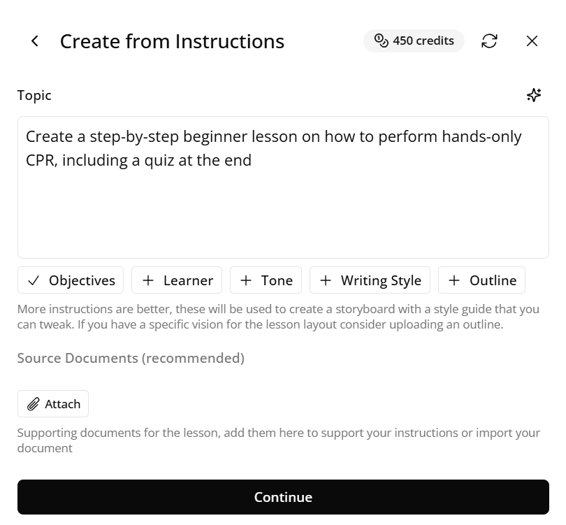
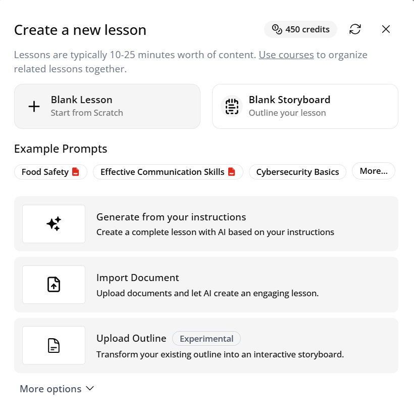
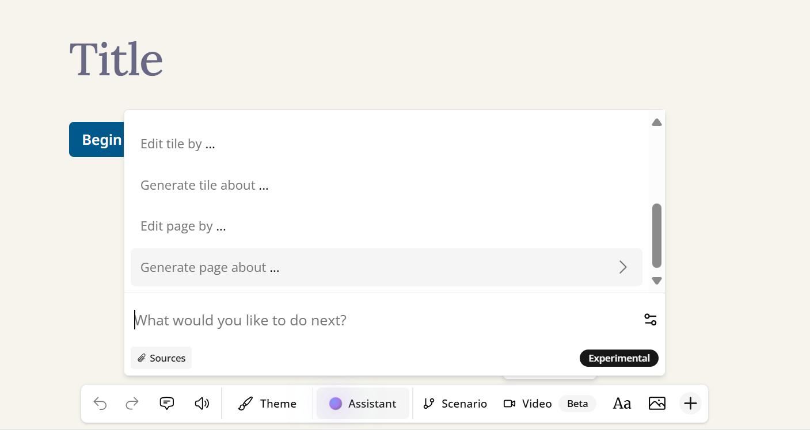
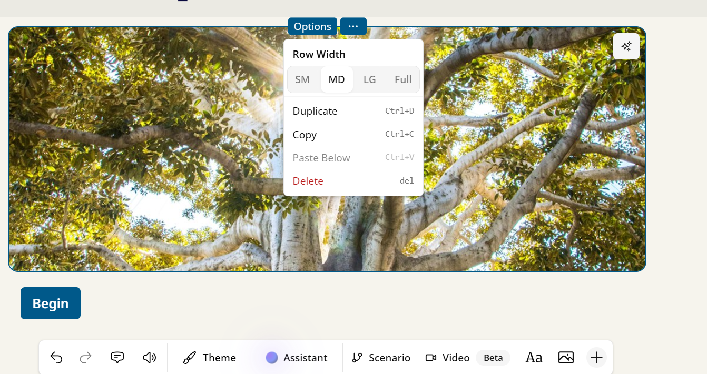
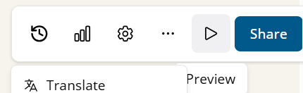
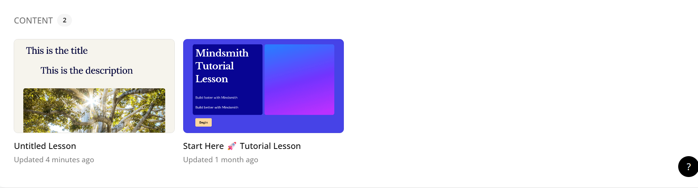

# Creating Lessons in Mindsmith

Creating a lesson in Mindsmith is simple and intuitive. Whether you're building a quick microlearning module or a multi-step course, this guide walks you through the full process.

By following this walkthrough, you’ll not only understand how to create content effectively but also how to structure lessons that keep learners engaged. Mindsmith's design emphasizes user-friendliness, so even beginners can produce impactful content with ease. You can always return to this guide whenever you're feeling stuck, or just want to refresh your process.

---

## 🪄 1. Start with the AI Course Generator (Optional)

If you prefer to generate your first draft quickly, click the **“Generate Course with AI”** button on the dashboard. You’ll be prompted to enter a description or objective for your lesson.

The more specific your prompt, the better the results. For example, instead of saying...

<h3> Teaching CPR </h3>

<h3>“Create a step-by-step beginner lesson on how to perform hands-only CPR, including a quiz at the end.”</h3>

This feature is perfect for when you're short on time or want to brainstorm ideas with a creative assist. The AI can generate logical outlines, key teaching points, and even include quizzes or interactive elements depending on your request. You’re not locked into the result—it’s editable, so you can fine-tune it afterward to better reflect your style and learning objectives. It's especially helpful for teams who need to scale content production across departments or subjects.

  
*Figure 1. Prompting the AI to generate a course draft*

---

## ✍️ 2. Create a Lesson Manually

To build a lesson from scratch:

1. Click **“Create Lesson”** from your dashboard.  
2. Add a descriptive **lesson title** to help you stay organized.  
3. Choose a **template** or start with a blank canvas.  
4. Click **“Add Step”** to begin constructing your content.

This manual method gives you full control over the structure and pacing of your lesson. It’s great for educators or content creators who already have a clear vision and want to implement their ideas step by step. You can start small with just a few slides or build something more robust that spans an entire curriculum. As you build, Mindsmith provides tips and suggestions that keep you on track without overwhelming you.

  
*Figure 2. Selecting “Create Lesson” from the dashboard*

---

## 🧱 3. Add and Customize Steps

Each lesson is composed of steps. You can think of each step as a screen or slide in your course.

- **Text** – for explanations or instructions  
- **Image** – to illustrate concepts  
- **Quiz** – to check understanding (MCQ, T/F, short answer)  
- **Embed** – to add videos or interactive tools  

You can mix and match step types to suit the way your audience learns best. For instance, start with a short video embed, follow it with a few bullet-point explanations, and end the section with a quiz to reinforce key takeaways. Visual elements like images or videos improve retention, and quizzes keep learners actively engaged. The flexibility to rearrange or customize each step means you can iterate on your lesson until it feels just right.

  
*Figure 3. Example of various step types available in the editor*

---

## 🧩 4. Reorder, Duplicate, or Delete Steps

Use the drag-and-drop feature in the lesson editor to rearrange steps. You can also:

- Click the **duplicate icon** to reuse a step.  
- Click the **trash icon** to remove a step.

This kind of step manipulation helps you refine the flow and learning experience. For example, if a section feels out of place, just drag it where it makes more sense—no need to recreate it from scratch. Duplication is useful when building content that follows a repeatable structure, like a quiz after every video or summary slides at the end of each module. Deleting steps is safe too—Mindsmith will usually ask you to confirm, preventing any accidental loss of work.

  
*Figure 4. Rearranging and managing steps for better flow*

---

## 🧪 5. Preview Your Lesson

Click the **Preview** button in the top-right corner to see your lesson from a learner’s perspective. This helps you catch:

- Formatting issues  
- Confusing step transitions  
- Unclear instructions  

Previewing often is a good habit—it ensures your final product is polished and professional. You'll spot any design flaws, such as unclear layouts, missing elements, or steps that may feel disconnected from one another. It’s a valuable tool for refining the learner experience, ensuring that the lesson is intuitive and enjoyable.

  
*Figure 5. Preview mode showing how the course appears to learners*

---

## 📥 6. Save Your Progress

Mindsmith auto-saves your work, but you can also click **“Save”** manually.

To return later, simply revisit the lesson from the dashboard.

Saving is a crucial part of your workflow. While auto-save protects you from data loss, clicking "Save" when you reach milestones ensures you’re safely storing your progress. This is especially helpful when working on larger lessons or when juggling multiple lessons at once. After saving, you can continue your work at any time without worrying about losing any of your changes.

  
*Figure 6. Viewing Content on Dashboard*

---

Still confused and want an easy visual aid to help you create a lesson? Watch this video below, it'll only take a couple of minutes and you'll create a simple lesson. Don't be afraid of being confused, being confused is the first step to truly grasping a concept.

## 📽️ Video Walkthrough

<video controls width="600">
  <source src="/vids/CreatingLessons.mp4" type="video/mp4" />
  Your browser does not support the video tag.
</video>

*Figure 7. Video walkthrough explaining how to create and edit a lesson.*

---

## 🎉 You Did It!

<h4>You’ve successfully created your first lesson in Mindsmith! Whether you’re developing training for a team, onboarding new employees, or creating public learning content, you now have the tools to bring your ideas to life. It only take 3 minutes and now you have a lesson that's real and you have the basics of editing as well. It will only go up here, the sky is the limit.</h4>

