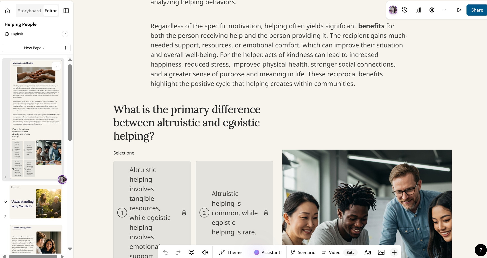
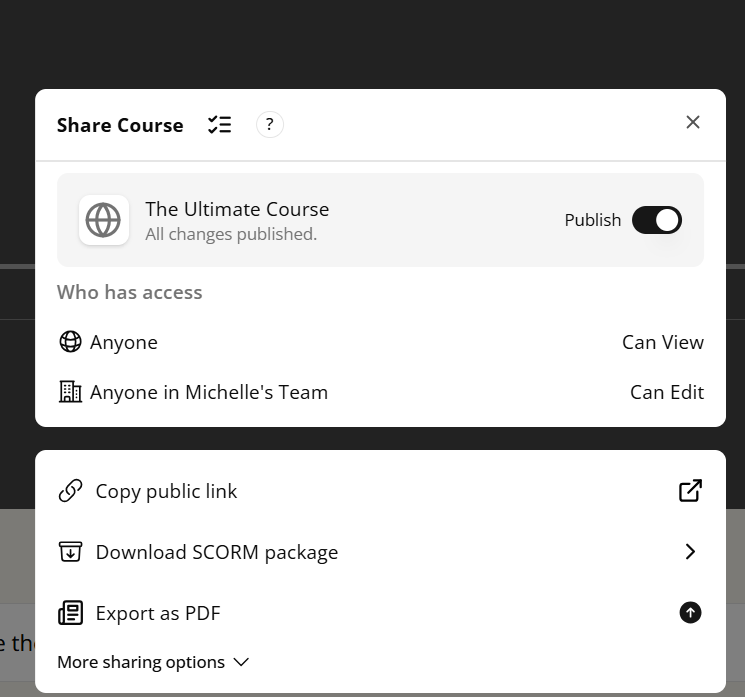
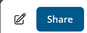
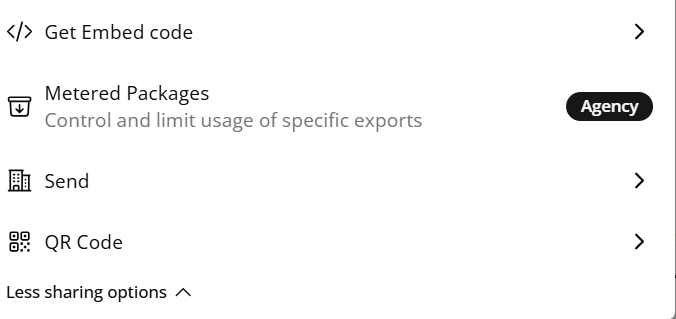
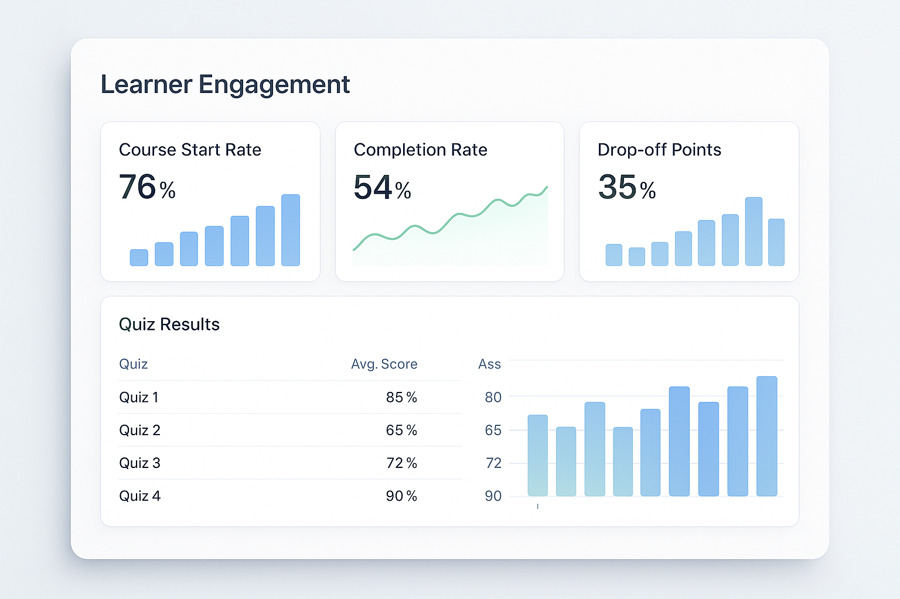
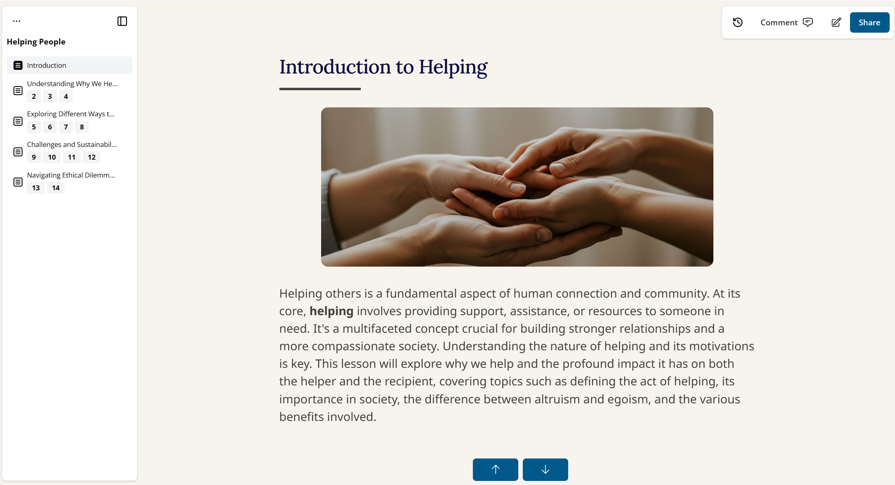

# Publishing in Mindsmith

Once you’ve created a course or lesson, it’s time to share it with learners. Whether you're rolling out a training program for your team, launching a course for external clients, or creating content for public learners, Mindsmith provides several publishing options. This guide takes you step by step through the process, ensuring that your course reaches its intended audience smoothly and effectively.

---

## ✅ 1. Finish and Review Your Lesson or Course

Before you hit the **“Publish”** button, take a moment to review your work. You wouldn’t launch a product without testing it first, and the same principle applies to courses. Here’s your checklist for a final review:

- **Typos**: While it may seem small, typos can be distracting and reduce the professionalism of your course.
- **Step order issues**: Ensure that the flow of the course is logical and that steps follow a natural progression.
- **Logic errors**: Make sure that the content makes sense—test interactive components like quizzes and embeds to ensure they function properly.

Walking through your lesson as a learner will allow you to spot any areas that might confuse or frustrate users. Think of it like proofreading a book: the author knows the story, but the reader is coming in fresh and needs a clear, seamless experience.

  
*Figure 1. Final review before publishing*

By previewing, you’ll get to see your course as if you were a learner, allowing you to catch any issues that might not be obvious from the editing interface. Look for areas where the instructions might be unclear, visuals may be out of place, or interactive elements could break the flow. If something feels off, make adjustments before publishing.

---

## 🚀 2. Publish Your Course

When everything looks good, it’s time to go live. The **“Publish”** button is your gateway to making your course available to others. Once you click it, you’ll be presented with a few options that define how your course will be accessed:

1. Click the **“Publish”** button to begin the process.
2. Choose your **visibility** setting:
   - **Public**: Anyone with the link can access the course. This is perfect for courses you want to make widely available, such as open tutorials or public educational resources.
   - **Unlisted**: The course won’t show up in search results, but you can share the link directly with anyone you choose. This is ideal for clients or a select group of learners.
   - **Private**: Available only to specific users, typically on paid plans. This is best for internal teams or highly sensitive content that you want to restrict access to.

Visibility settings act as your course’s security measures. It’s like setting the lock on your front door—**public** is open for everyone, **unlisted** is like a private invitation, and **private** is locked for your eyes only (or for the intended recipients).

  
*Figure 2. Visibility options in the publishing dialog*

Once you’ve made your selection, your course is officially published, but there are still several ways to distribute it, depending on your needs.

---

## 🔗 3. Share the Course Link

After publishing, Mindsmith provides a **direct link** to your course. This is your unique access key to the content, and you can share it in a variety of ways:

- **Email**: Send the link directly to your learners’ inboxes for easy access.
- **LMS (Learning Management Systems)**: If your organization uses an LMS, you can upload the link there for seamless integration.
- **Slack**: For internal teams, Slack is a great way to distribute the course quickly.
- **Social media**: If your course is public or unlisted, social media is a great way to spread the word and encourage others to join.

The link is your gateway to sharing your course; it’s as simple as clicking copy and pasting it wherever it’s needed. You can also go beyond just sharing a link:

- **Embed it on your site**: If you run a blog, a knowledge-sharing website, or any kind of external site, you can add the course directly onto your pages.
- **Print a QR code**: QR codes are becoming increasingly popular in offline environments. You can print a QR code that learners can scan with their phones to quickly access your course.

  
*Figure 3. Copying and sharing a direct course link*

By having these multiple sharing options, Mindsmith ensures that you can meet learners where they are—whether that’s in email, social media, or even a physical flyer with a QR code.

---

## 🧑‍💻 4. Embed the Course in a Website

If you want to take things one step further and integrate your course directly into a website, Mindsmith has you covered. After publishing, you’ll receive an **iframe embed code**, which you can use to seamlessly integrate your course into:

- Websites: Perfect for blogs or content sites that host educational material.
- Internal dashboards: Great for businesses that need to share training content with employees or stakeholders.
- Client portals: If you’re offering courses to clients, embedding them in your client portal ensures a smooth, professional experience.

Embedding your course is like placing a plug-and-play module right into your website—no technical skills required. Simply copy the iframe code and drop it into the appropriate section of your website’s backend. It’s as easy as adding an image to a page, but now you’re offering full course functionality!

  
*Figure 4. Copying the iframe embed code from publish options*

---

## 📊 5. Track Learner Engagement (Pro)

Once your course is out in the world, you’ll want to know how well it’s performing. With Mindsmith's **Pro** plan, you can track a variety of learner engagement metrics, such as:

- **Start/completion tracking**: See who is starting the course and, more importantly, who finishes it. This gives you insight into how engaging the course is and where learners might be dropping off.
- **Quiz results**: Analyze learner performance on quizzes to identify areas where learners may be struggling. This can inform adjustments to the course content.
- **Drop-off analysis**: Understand at which step or section learners tend to drop off. This data is invaluable for refining your course and ensuring that learners stay engaged until the end.

Tracking engagement is like monitoring foot traffic in a store. You can see who’s browsing, who’s engaging with the content, and where improvements can be made to enhance the learner’s experience.

  
*Figure 5. Analytics dashboard showing user interactions*

This kind of feedback is crucial for optimizing your content and making sure your learners get the best possible experience. You can use this data to fine-tune your course, whether it’s adding more content to sections where learners struggle or tweaking the course structure to improve flow.

---

## 🔁 6. Update Published Courses

One of the great advantages of Mindsmith is that updates to your course go live instantly. This means you don’t have to worry about republishing—any edits, whether they’re correcting typos, updating outdated content, or adding new information, will be reflected immediately.

For example, if a policy changes or new information becomes available, simply update the lesson, and all learners will see the latest version without you needing to republish or notify them. This is especially useful for businesses or educational institutions that need to keep content current without the hassle of dealing with outdated versions.

- **Fix typos**: Even after publishing, you can correct small errors that may have slipped through.
- **Update outdated content**: As new information becomes available, make sure your learners always have access to the most up-to-date resources.
- **Policy changes**: If your training involves compliance or legal information, updating the course ensures that learners have access to the latest regulations.

  
*Figure 6. Editing a published course without needing to republish*

This feature is like having an automatic refresher for your course. The content stays fresh, and your learners are always up to date with the latest knowledge.

---

## 📽️ Video Walkthrough

If you're still unsure about any of the steps, or if you prefer a visual guide, watch the video walkthrough below. In just a few minutes, you’ll get an easy-to-follow, step-by-step demonstration on how to publish your course and make it available to learners.

<video controls width="600">
  <source src="/vids/PublishingALesson.mp4" type="video/mp4" />
  Your browser does not support the video tag.
</video>

*Figure 7. Video tutorial for publishing either your lesson or course*

<h4> By following this process, you ensure that your course or lesson is not only ready to be consumed but is easily accessible, shareable, and trackable. Mindsmith's publishing features give you everything you need to successfully share your content with your audience, track its impact, and make improvements as necessary.</h4>

---
## 🎉 You Did It!

You’ve successfully published your first lesson in Mindsmith! It works similarly publishing the course or a lesson. So this video tutorial above can be used for either. Now that you know how to create and publish both a lesson and a course, you'll be on your way to creating some amazing courses. Whether you're an instructional designer or content creator, just know that with Mindsmith, these videos were only the beginning. If you spend hours practicing and developing your skills, you will definitely acheive whatever goal you are after.

If you're interested in APIs check out the API documentation for Minddocs [here](../api/APIdocumentation)

